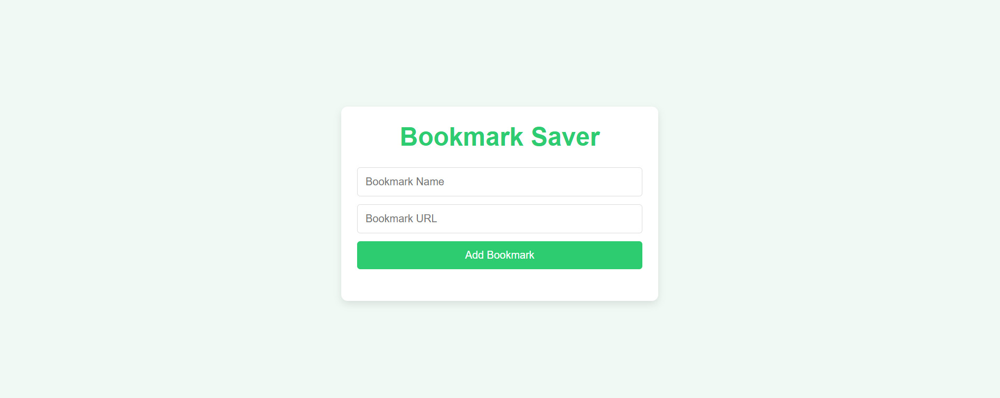

# 🔖 Bookmark Saver

A clean, simple, and fully functional **Bookmark Saver** web application that allows you to save and organize your favorite website links. Add bookmarks with custom names, open them instantly, and manage your list effortlessly — all stored locally in your browser.

<p align="center">
  <a href="https://bookmark-saver-12.netlify.app/" target="_blank">
    
  </a>
  <a href="https://github.com/razazaheer12/Bookmark-Saver" target="_blank">
    
  </a>
</p>

---

## 📸 Preview



> **Live URL:** [https://bookmark-saver-12.netlify.app/](https://bookmark-saver-12.netlify.app/)

---

## ✨ Features

| Feature | Description |
|---------|-------------|
| ➕ **Add Bookmarks** | Save any website with a custom name and URL. |
| 🔗 **Quick Access** | Click any bookmark to open it in a new tab. |
| 🗑️ **Remove Bookmarks** | Delete unwanted bookmarks with a single click. |
| 💾 **Local Storage** | All bookmarks persist in your browser — no account needed. |
| 🔒 **URL Validation** | Automatically validates that URLs start with http:// or https://. |
| ✅ **Input Validation** | Ensures both name and URL fields are filled before saving. |
| 📱 **Responsive Design** | Works smoothly on desktop and mobile devices. |
| 🎨 **Clean UI** | Simple, modern interface with green accent colors. |

---

## 🛠️ Tech Stack

<p align="left">
  
  
  
  
</p>

- **HTML5** — Semantic structure with form inputs
- **CSS3** — Clean styling with Flexbox and hover effects
- **Vanilla JavaScript** — Pure DOM manipulation, URL validation, and localStorage API
- **Netlify** — Reliable static site hosting

---

## 🚀 Getting Started

### Prerequisites

You only need a modern web browser to run this project locally. No build tools or dependencies required!

### Installation

1. **Clone the repository**

   ```bash
   git clone https://github.com/razazaheer12/Bookmark-Saver.git
   ```

2. **Navigate to the project folder**

   ```bash
   cd Bookmark-Saver
   ```

3. **Open in browser**

   Simply open the `index.html` file in your favorite browser:

   ```bash
   # On Windows
   start index.html

   # On macOS
   open index.html

   # On Linux
   xdg-open index.html
   ```

---

## 📖 How to Use

1. **Add a Bookmark** — Enter a name (e.g., "Google") and a URL (e.g., "https://google.com"), then click **Add Bookmark**.
2. **Open a Bookmark** — Click any saved bookmark link to open it in a new tab.
3. **Remove a Bookmark** — Click the "Remove" button next to any bookmark to delete it.
4. **Persistent Data** — Your bookmarks are saved automatically. Close and reopen the browser — your links will still be there!

---

## 📁 Project Structure

```
Bookmark-Saver/
│
├── index.html          # Main HTML structure
├── style.css           # All styles and responsive design
├── script.js           # Application logic and localStorage handling
└── README.md           # Project documentation
```

### File Overview

| File | Purpose |
|------|---------|
| `index.html` | Defines the app layout with title, input fields, add button, and bookmark list. |
| `style.css` | Provides a clean, modern design with green accents, card layout, and hover effects. |
| `script.js` | Handles all interactivity: adding/removing bookmarks, URL validation, and localStorage persistence. |

---

## 🎯 Key Functionalities

### Adding a Bookmark
```javascript
function addBookmark(name, url) {
  const li = document.createElement("li");
  const link = document.createElement("a");
  link.href = url;
  link.textContent = name;
  link.target = "_blank";

  const removeButton = document.createElement("button");
  removeButton.textContent = "Remove";
  removeButton.addEventListener("click", function () {
    bookmarkList.removeChild(li);
    removeBookmarkFromStorage(name, url);
  });

  li.appendChild(link);
  li.appendChild(removeButton);
  bookmarkList.appendChild(li);
}
```

### URL Validation
```javascript
if (!url.startsWith("http://") && !url.startsWith("https://")) {
  alert("Please enter a valid URL starting with http:// or https://");
  return;
}
```

### Data Persistence
```javascript
function saveBookmark(name, url) {
  const bookmarks = getBookmarksFromStorage();
  bookmarks.push({ name, url });
  localStorage.setItem("bookmarks", JSON.stringify(bookmarks));
}

function loadBookmarks() {
  const bookmarks = getBookmarksFromStorage();
  bookmarks.forEach((bookmark) => addBookmark(bookmark.name, bookmark.url));
}
```

---

## 🎨 Design Highlights

- 🌿 **Green Theme** — Fresh green (`#2ecc71`) accent color representing organization and productivity.
- 📦 **Card Layout** — Clean white card with subtle shadow for a modern look.
- 🖱️ **Interactive Buttons** — Hover effects on add and remove buttons for better user feedback.
- 📱 **Responsive** — Flexible width (90% on mobile, max 400px on desktop) for all screen sizes.
- 🔗 **Link Styling** — Green links with no decoration for a clean appearance.

---

## 🔮 Future Enhancements

- [ ] Edit existing bookmarks
- [ ] Categorize bookmarks with folders or tags
- [ ] Search/filter bookmarks
- [ ] Import/export bookmarks as JSON
- [ ] Favicon display for each bookmark
- [ ] Drag and drop to reorder
- [ ] Dark mode toggle
- [ ] Cloud sync with user authentication

---

## 🤝 Contributing

Contributions are welcome! If you have suggestions, bug fixes, or new features to add:

1. Fork the repository
2. Create a new branch (`git checkout -b feature/YourFeature`)
3. Commit your changes (`git commit -m 'Add some feature'`)
4. Push to the branch (`git push origin feature/YourFeature`)
5. Open a Pull Request

---

## 📄 License

This project is open source and available under the [MIT License](LICENSE).

---

## 🙏 Acknowledgments

- Built with ❤️ by [Raza Zaheer](https://github.com/razazaheer12)
- Hosted on [Netlify](https://www.netlify.com/)

---

<p align="center">
  <b>⭐ Star this repo if you found it helpful!</b>
</p>

<p align="center">
  <a href="https://bookmark-saver-12.netlify.app/">🌐 Live Demo</a> •
  <a href="https://github.com/razazaheer12/Bookmark-Saver">💻 GitHub Repo</a>
</p>
